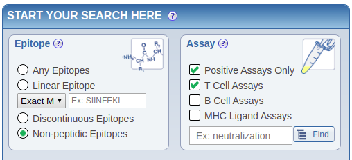
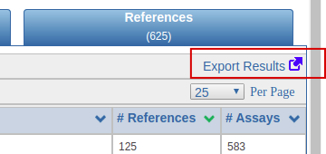

# NP_epitope_predictor

## Installation

### Clone the Repo

```
git clone https://github.com/paulzierep/NP_epitope_predictor.git
```

### Requirements (Conda)

Install conda:

[Conda installation](https://docs.conda.io/projects/conda/en/latest/user-guide/install/)

Activate a new environment:

```
conda activate **env_name**
```

Install all packages:

```
conda install --file requirements.txt
```

### Requirements (Pip)

Unfortunately rdkit is difficult to set up outside the coda env. Therefore this is not tested.
In general it should work to install rdkit with any method described here:

[rdkit installation](http://www.rdkit.org/docs/Install.html)

Then install the other packages with 

```
pip install -r requirements.txt
```

### Unzip the Data

In order to run a prediction it is not necessary to fit the predictor, it can run with pre-fitted data, which is provided in:

```
./tools/ML_data.zip
```

Unzip in same folder:

```
cd ./tools/
unzip ML_data.zip
```

## Run a prediction

### Input

An example how to run the prediction is given in the script:

```
cd ./tools/run_prediction.py
```

The predictor needs as input a correct SMILES string eg: "CCCCCCO".

There are two optional arguments which are currently included:

Argument | Parameter | Explanation
------------ | ----------|---
only_epitopes | True | The most similar epitopes are listed, 
only_epitopes | False | The most similar compounds from the entire ChEBI are listed
sort_order | "E" | Uses the eucleadien distance as similarity measure for the target compounds meaning the shown compounds have the most FPs in common with the query molecule 
sort_order | "T" | Uses the overall Tanimoto Coefficient as similarity measure, meaning the shown compound are most similar to the query molecule, this requires, that the similarity is computed between all compounds in the cluster and the query (takes a bit longer)

### Output

The predictor returns a dict which holds all needed information, eg.: Class, B_cell probability...

A tree of the dict is shown below. The ontology and fp_imp (FP importance) are pandas data frames. They can be converted into html, dict or json with (.to_html(),.to_dict() or to_json()).

```
error <class 'NoneType'>
input_svg <class 'str'>
cluster_info <class 'dict'>
	 Cluster <class 'int'>
	 Members <class 'int'>
	 Warning <class 'float'>
	 Name <class 'str'>
	 Ontology <class 'pandas.core.frame.DataFrame'>
classify_info_b <class 'dict'>
	 proba <class 'float'>
	 fp_imp <class 'pandas.core.frame.DataFrame'>
	 fitting_info <class 'NoneType'>
	 p_support <class 'int'>
	 n_support <class 'int'>
classify_info_t <class 'dict'>
	 proba <class 'float'>
	 fp_imp <class 'pandas.core.frame.DataFrame'>
	 fitting_info <class 'NoneType'>
	 p_support <class 'int'>
	 n_support <class 'int'>
```

The utility functions: *Results_To_Json* creates a JSON object from the results dict. 
The json tree can be observed for example by copy-and-pasting into http://jsonviewer.stack.hu/

The utility functions: *Results_To_Html* creates one possibility of how the HTML output could look like.
Although the incorporation of the json into a framework would be preferable. 

### Error handling

If the SMILES can not be parsed,
the parsing error is recorded and stored in the 
result dict in "error".
This can be shown to the user, as it is currently implemented in *Results_To_Json* and *Results_To_Html*.

# Update the Classifier

The update requires to download 3 files:

A CSV for each epitope type, eg. B cells and T cells from the IEDB and 
the SDF file of the ChEBI 3 star dataset (ChEBI_complete_3star.sdf).

The update data is stored in the folder NP_epitope_predictor_gitlab/tool/ML_data_updated;
this folder is not shared via git (too large), so the ML_data_updated.zip file needs to be
unzipped first.

The folder ML_data should not be touched, keep the original data for the publication.

### IEDB data

Download the epitopes via an IEDB query:
1) Go to https://www.iedb.org/
2) 

|  | 
|:--:| 
| Select the epitopes |

3) 

|  |
|:--:| 
|  |
|:--:| 
| Export csv 

4) Copy the generated file (eg. epitope_table_export_1590139338.zip) into the update folder 
(NP_epitope_predictor_gitlab/tool/ML_data_updated/epitope_update_input/\*\*update_date\*\*)

5) Unzip the file and rename into epitope_table_b_cell_pos.csv
6) Repeat the same process for T cells

### ChEBI data

Download the CSV file from ChEBI:
1) Go to https://www.ebi.ac.uk/chebi/downloadsForward.do

2) 
|  | 
|:--:| 
| Downoload the SDF file |

3) Unzip and copy  into the update folder 
(NP_epitope_predictor_gitlab/tool/ML_data_updated/epitope_update_input/\*\*update_date\*\*)

### Run the update script

1) The update folder 
(NP_epitope_predictor_gitlab/tool/ML_data_updated/epitope_update_input/\*\*update_date\*\*)
should contain the files:

	1) epitope_table_b_cell_pos.csv
	2) epitope_table_t_cell_pos.csv
	3) ChEBI_lite_3star.sdf

3) Set the path of the update folder in the update script (update_predictor.py)
(NP_epitope_predictor_gitlab/tool/ML_data_updated/epitope_update_input/\*\*update_date\*\*)

	```
	#this is where the input data (IEDB csv and ChEBI sdf) is located
	UPDATE_PATH = os.path.join(DATA_PATH, 'epitope_update_input', '05-11-2020') 
	```

4) Run the update script (update_predictor.py), approx.: 1780.9s

5) This should generate all the new files in ML_data_updated.
The django wrapper uses this files. No further modifications needed.
The online view will now compute results based on the new data.

### Update the docker image

1)
```
sudo docker build -t NP_epitope_predictor:1.0 . --no-cache
```

2) Push docker image to gitlab


